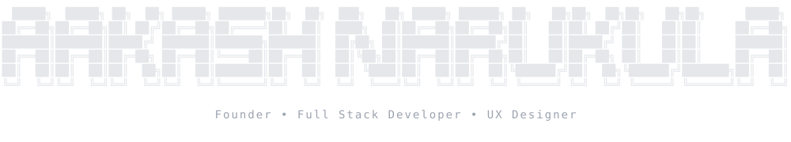
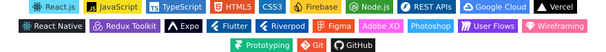

<div align="center">



<br/>

<a href="https://github.com/aakashnarukula-dev">
  
</a>

### Things I code with




<table align="center"><tr>
<td><a href="https://gyftalala.com"></a></td>
<td></td>
</tr></table>

</div>

---

## `> whoami`

```ts
const aakash = {
  role:     "Founder @ Gyftalala",
  since:    "Feb 2018",
  stack:    ["Full-Stack", "UX Design", "Automation", "AI/LLMs"],
  building: ["AI-powered gifting brand", "voice-first tools", "EV companion apps"],
  shipped:  "10,000+ orders delivered",
  focus:    "turning messy human intent into clean software",
  motto:    "design it, ship it, automate it.",
};
```

---

## `> ai`

```ts
const ai = {
  shipped: [
    "multi-channel support chatbot — persistent memory keyed to contact, guardrail auto-escalation → WhatsApp handoff",
    "image-gen pipeline — FLUX.1 + ComfyUI, identity-preserving portraits @ 2048×2048",
    "voice assistant — on-device + Gemini, OCR extraction & AI categorization",
  ],
  doing:   ["prompt engineering", "conversational UX", "RAG / context memory", "LLM agents"],
  tools:   ["Claude", "GPT", "Gemini", "Vertex AI", "FLUX.1", "ComfyUI", "Whisper"],
};
```

🤖 **Building with AI** — conversational agents with memory & guardrails · LLM-driven automation that removes manual ops · generative image pipelines · voice-first interfaces.

---

## `> featured`

<table>
<tr>
<td width="50%" valign="top">

### 🎁 [Gyftalala](https://gyftalala.com)
AI-powered gifting brand. 10,000+ orders delivered. End-to-end: product, UX, fulfillment automation.

`Next.js` · `Supabase` · `LLMs` · `Automation`

</td>
<td width="50%" valign="top">

### 🎙️ [air-prompt](https://github.com/aakashnarukula-dev/air-prompt)
Cross-device speech-to-text. Phone mic → cleaned text auto-pasted on Mac.

`Whisper` · `WebRTC` · `macOS`

</td>
</tr>
<tr>
<td width="50%" valign="top">

### 🛴 [esp32-ev](https://aakashnarukula-dev.github.io/esp32-ev/)
Electric scooter companion app. Dark, CRED-style iOS UI. [Live demo →](https://aakashnarukula-dev.github.io/esp32-ev/)

`ESP32` · `BLE` · `iOS UI`

</td>
<td width="50%" valign="top">

### 🗣️ [omni-ai](https://github.com/aakashnarukula-dev/omni-ai)
Voice-first personal vault. Tasks, alarms, notes, cards & IDs — all by speaking.

`TypeScript` · `Voice AI` · `PWA`

</td>
</tr>
</table>

---

## `> stats`

<div align="center">


<br/><br/>


<br/><br/>


</div>

---

## `> philosophy`

```diff
+ ship small. automate the rest.
+ most problems shrink when you stop doing them by hand.
+ design → build → observe → delete. repeat.
- no half-finished implementations.
```

<div align="center">
<sub><code>// EOF</code></sub>
</div>

